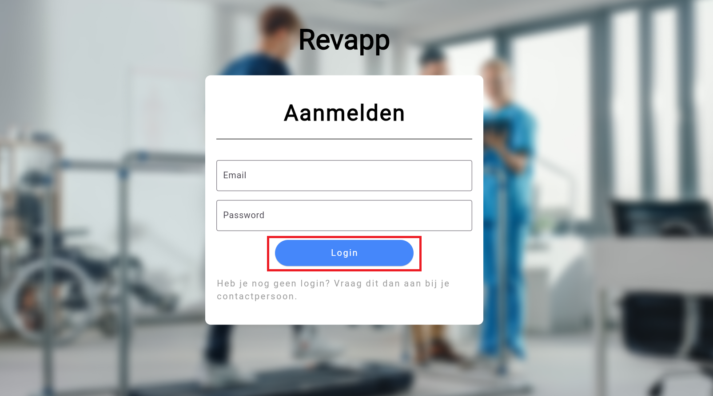
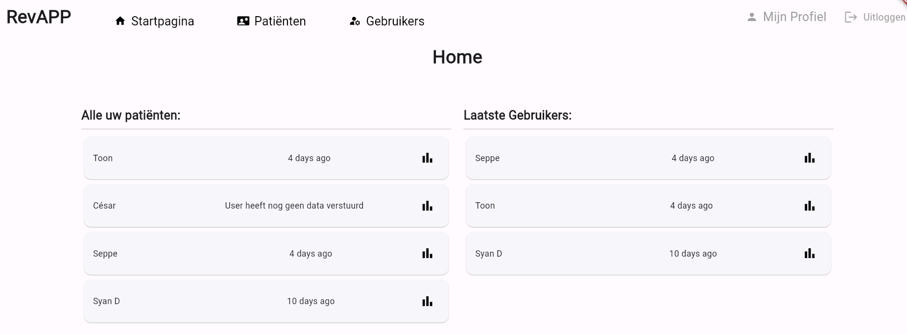
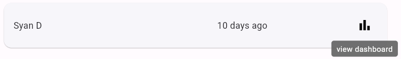
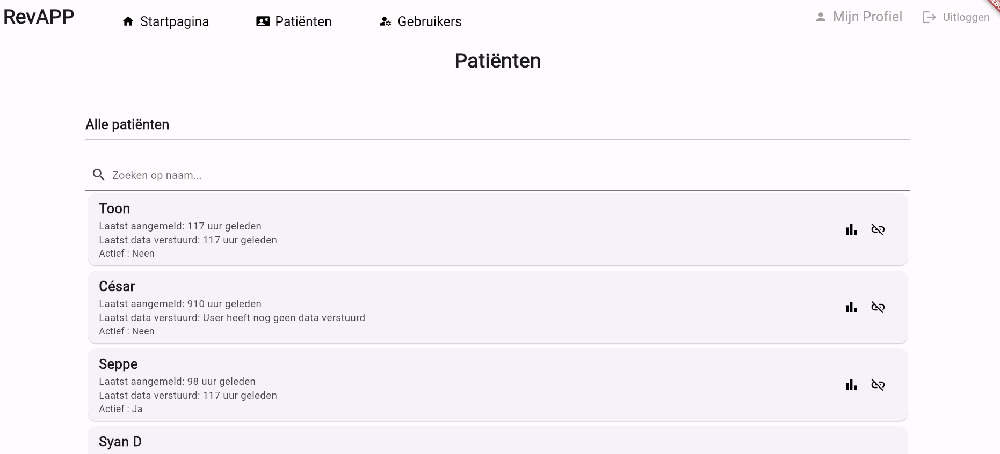
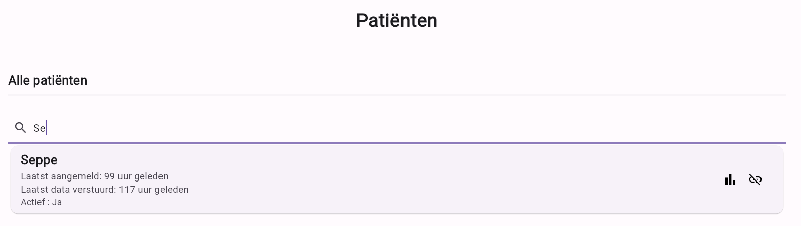
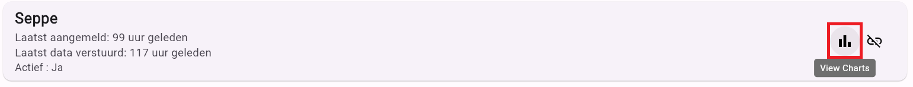
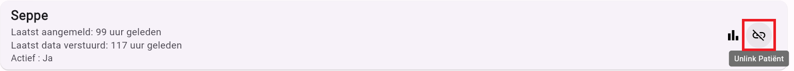
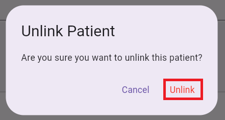

# RevApp

Gemaakt door:
| Name                                                         | GitHub Username                                           |
|:-------------------------------------------------------------|:----------------------------------------------------------|
| [Seppe Stroobants](mailto:r0955288@student.thomasmore.be)    | [SeppeStroobants](https://github.com/SeppeStroobants)     |
| [Toon Van Dyck](mailto:r0736361@student.thomasmore.be)       | [VanDyckToon](https://github.com/VanDyckToon)             |
| [César Van Leuffelen](mailto:r0929448@student.thomasmore.be) | [cesarvanleuffelen](https://github.com/cesarvanleuffelen) |
| [Matt Boeren](mailto:r0932402@student.thomasmore.be)         | [MattBoeren](https://github.com/MattBoeren)               |
| [Syan Delbart](mailto:r0786843@student.thomasmore.be)        | [syandelbart](https://github.com/syandelbart)             |
| [Siebe Camerman](mailto:r0889616@student.thomasmore.be)      | [SiebeCamerman](https://github.com/SiebeCamerman)         |

RevApp is een applicatie gemaakt in opdracht van Mobilab. Het doel van RevApp is om het opvolgen van revaliderende patiënten gemakkelijker te maken. Dit gebeurt door middel van twee aspecten van deze applicatie.

## Webapplicatie

De webapplicatie wordt vooral gebruikt door de kinesist of andere soorten geneesheren die instaan voor de opvolging van een patiënt. Zowel de patiënt als de geneesheer kan inloggen in de webapplicatie, met enkele verschillen in mogelijkheden:

- **Patiënt**:
    - Kan zijn profiel raadplegen.
    - Kan zijn gegevens zien.
    - Kan het gekoppelde e-mailadres en wachtwoord wijzigen indien nodig.

- **Geneesheer**:
    - Kan zijn profiel raadplegen.
    - Kan de vooruitgang van zijn patiënten zien.
    - Krijgt een overzicht van elk van zijn patiënten, inclusief de laatste ingelogde patiënten die oefeningen hebben uitgevoerd.
    - Kan voor elke patiënt een dashboard raadplegen waar de berekeningen van de patiënt zijn oefeningen worden weergegeven in een grafiek. Deze grafiek toont hoe vaak en hoe correct de oefeningen zijn uitgevoerd, wat sneller ingrijpen mogelijk maakt als oefeningen fout worden uitgevoerd.

## Mobiele Applicatie

De mobiele applicatie wordt vooral gebruikt door de patiënten zelf. Via deze applicatie kunnen ze inloggen en hun oefeningen starten. De oefeningen worden opgenomen door middel van sensoren die samenwerken om een berekening van hun oefeningen te maken. In de mobiele applicatie kunnen de patiënten:

- Een meting met de sensoren starten.
- Nagaan hoe de connectie is tussen de sensoren en de applicatie.

# Functionaliteiten

## Login Pagina
### Hoe log je in?
Je kan inloggen bij RevApp door middel van je email adres en wachtwoord. Dit wordt meegegeven door je behandelende arts. Als je dit nog niet hebt moet je dit aanvragen bij je behandelende arts.

Vul in je e-mail in het vakje E-mail en uw paswoord in het vakje Paswoord. Klik vervolgens op de knop ‘Login’ en je wordt ingelogd in het systeem indien je inlog gegevens correct zijn.

---
## Mijn profiel pagina
De ‘Mijn profiel pagina’ wordt automatisch getoond voor patiënten. Dit is echter ook de enige pagina die een patiënt kan raadplegen op de webapplicatie.
Op deze pagina worden de gegevens van de gebruiker getoond zoals de gebruikersnaam, e-mailadres, rol en laatste datum van data verstuurd.
Op deze pagina is het ook mogelijk om als gebruiker uw e-mail te veranderen en een nieuw paswoord in te stellen.
### E-mail aanpassen

### Wachtwoord aanpassen

## Start pagina
Als er een opvolger of admin ingelogd is op de webapplicatie dan krijgt deze de startpagina te zien.

Op de startpagina krijgt een opvolger aan de linkerkant alle patiënten te zien die gelinkt zijn aan zijn account. Aan de rechterkant krijgt de opvolger een overzicht van de laatste 5 gebruikers die data hebben verstuurd naar het platform. Hierdoor is het makkelijker voor een opvolger om een overzicht te krijgen van zijn patiënten die onlangs oefeningen hebben uitgevoerd.
## Resultaten raadplegen van patiënt
Bij elke patiënt staat er een icoon bij die het mogelijk maakt om de resultaten van zijn/haar oefeningen te bekijken.

Als je op dit icoon klikt krijg je een overzicht van de patiënt zijn resultaten door middel van een grafiek. Hieruit kan de behandelende arts nagaan hoe de patiënt zijn oefeningen doet.

## Patiënten pagina
De patiënten pagina geeft een overzicht van alle patiënten van een behandelende arts. Op deze pagina krijgt hij/zij een overzicht van al zijn patiënten.

### Zoekfunctie
De behandelende arts heeft ook de mogelijkheid om via een zoekbalk te zoeken achter een specifieke patiënt. Doormiddel van het invulveld zal de applicatie te patiënten laten zien die voldoen aan de zoekterm.

### Resultaten raadplegen van patiënt
Net zoals op de startpagina, kan ook hier de behandelende arts de resultaten van zijn patiënten raadplegen, door middel van op het icoon te klikken.

### Loskoppelen van patiënt
Als de patiënt om welke reden dan ook niet langer verbonden is met de behandelend arts, kan de arts de patiënt ontkoppelen door op het juiste pictogram te klikken. Dit zal resulteren in het loskoppelen van de patiënt van de behandelend arts en de patiënt zal tevens uit het overzicht van de arts verdwijnen.

Hierna verschijnt er een pop-upvenster dat u vraagt om te bevestigen of u deze patiënt daadwerkelijk wilt ontkoppelen. Als u op 'ontkoppelen' klikt, verdwijnt deze patiënt uit uw overzicht.

## Gebruiker pagina
