# RevApp

Gemaakt door:
| Name                                                         | GitHub Username                                           |
|:-------------------------------------------------------------|:----------------------------------------------------------|
| [Seppe Stroobants](mailto:r0955288@student.thomasmore.be)    | [SeppeStroobants](https://github.com/SeppeStroobants)     |
| [Toon Van Dyck](mailto:r0736361@student.thomasmore.be)       | [VanDyckToon](https://github.com/VanDyckToon)             |
| [César Van Leuffelen](mailto:r0929448@student.thomasmore.be) | [cesarvanleuffelen](https://github.com/cesarvanleuffelen) |
| [Matt Boeren](mailto:r0932402@student.thomasmore.be)         | [MattBoeren](https://github.com/MattBoeren)               |
| [Syan Delbart](mailto:r0786843@student.thomasmore.be)        | [syandelbart](https://github.com/syandelbart)             |
| [Siebe Camerman](mailto:r0889616@student.thomasmore.be)      | [SiebeCamerman](https://github.com/SiebeCamerman)         |

RevApp is een applicatie gemaakt in opdracht van Mobilab. Het doel van RevApp is om het opvolgen van revaliderende patiënten gemakkelijker te maken. Dit gebeurt door middel van twee aspecten van deze applicatie.

## Webapplicatie

De webapplicatie wordt vooral gebruikt door de kinesist of andere soorten geneesheren die instaan voor de opvolging van een patiënt. Zowel de patiënt als de geneesheer kan inloggen in de webapplicatie, met enkele verschillen in mogelijkheden:

- **Patiënt**:
    - Kan zijn profiel raadplegen.
    - Kan zijn gegevens zien.
    - Kan het gekoppelde e-mailadres en wachtwoord wijzigen indien nodig.

- **Geneesheer**:
    - Kan zijn profiel raadplegen.
    - Kan de vooruitgang van zijn patiënten zien.
    - Krijgt een overzicht van elk van zijn patiënten, inclusief de laatste ingelogde patiënten die oefeningen hebben uitgevoerd.
    - Kan voor elke patiënt een dashboard raadplegen waar de berekeningen van de patiënt zijn oefeningen worden weergegeven in een grafiek. Deze grafiek toont hoe vaak en hoe correct de oefeningen zijn uitgevoerd, wat sneller ingrijpen mogelijk maakt als oefeningen fout worden uitgevoerd.

## Mobiele Applicatie

De mobiele applicatie wordt vooral gebruikt door de patiënten zelf. Via deze applicatie kunnen ze inloggen en hun oefeningen starten. De oefeningen worden opgenomen door middel van sensoren die samenwerken om een berekening van hun oefeningen te maken. In de mobiele applicatie kunnen de patiënten:

- Een meting met de sensoren starten.
- Nagaan hoe de connectie is tussen de sensoren en de applicatie.

# Functionaliteiten

## Login Pagina
### Hoe log je in?
Je kan inloggen bij RevApp door middel van je email adres en wachtwoord. Dit wordt meegegeven door je behandelende arts. Als je dit nog niet hebt moet je dit aanvragen bij je behandelende arts.

Vul in je e-mail in het vakje E-mail en uw paswoord in het vakje Paswoord. Klik vervolgens op de knop ‘Login’ en je wordt ingelogd in het systeem indien je inlog gegevens correct zijn.

## Mijn profiel pagina
De ‘Mijn profiel pagina’ wordt automatisch getoond voor patiënten. Dit is echter ook de enige pagina die een patiënt kan raadplegen op de webapplicatie.
Op deze pagina worden de gegevens van de gebruiker getoond zoals de gebruikersnaam, e-mailadres, rol en laatste datum van data verstuurd.
Op deze pagina is het ook mogelijk om als gebruiker uw e-mail te veranderen en een nieuw paswoord in te stellen.
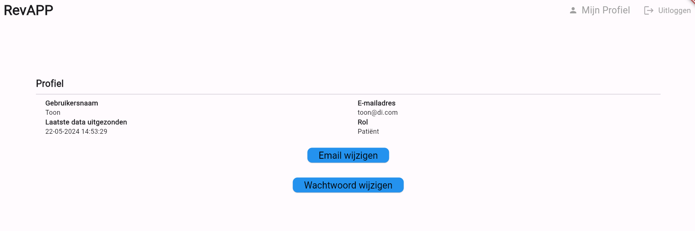
### E-mail aanpassen
Om uw e-mailadres aan te passen moet je klikken op de knop 'E-mail wijzigen'.
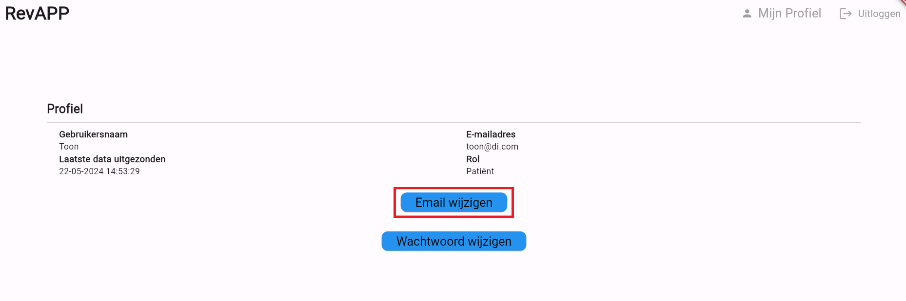
Vervolgens komt er een pop-up scherm die vraagt om je wachtwoord in te vullen.
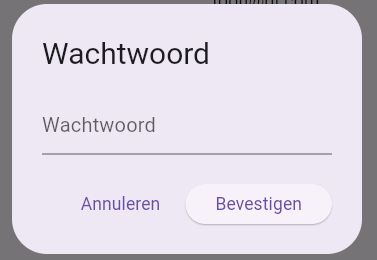
Hierna krijg je de optie om een nieuw e-mailadres op te geven. Klik vervolgens 'Bevestigen' om op te slaan.
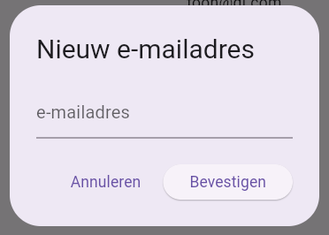
### Wachtwoord aanpassen
Om uw wachtwoord aan te passen moet je klikken op de knop 'Wachtwoord wijzigen'.

Vervolgens komt er een pop-up scherm die vraagt om je wachtwoord in te vullen. Klik op 'Bevestigen' om door te gaan.
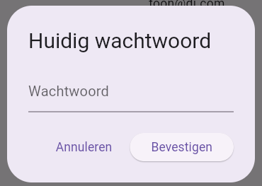
Vul in je nieuwe wachtwoord en klik 'Bevestigen' om door te gaan.
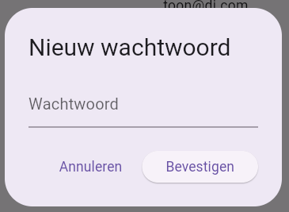
Je nieuwe wachtwoord is nu opgeslagen in het systeem.

## Start pagina
Als er een opvolger of admin ingelogd is op de webapplicatie dan krijgt deze de startpagina te zien.

Op de startpagina krijgt een opvolger aan de linkerkant alle patiënten te zien die gelinkt zijn aan zijn account. Aan de rechterkant krijgt de opvolger een overzicht van de laatste 5 gebruikers die data hebben verstuurd naar het platform. Hierdoor is het makkelijker voor een opvolger om een overzicht te krijgen van zijn patiënten die onlangs oefeningen hebben uitgevoerd.
## Resultaten raadplegen van patiënt
Bij elke patiënt staat er een icoon bij die het mogelijk maakt om de resultaten van zijn/haar oefeningen te bekijken.

Als je op dit icoon klikt krijg je een overzicht van de patiënt zijn resultaten door middel van een grafiek. Hieruit kan de behandelende arts nagaan hoe de patiënt zijn oefeningen doet.

## Patiënten pagina
De patiënten pagina geeft een overzicht van alle patiënten van een behandelende arts. Op deze pagina krijgt hij/zij een overzicht van al zijn patiënten.

### Zoekfunctie
De behandelende arts heeft ook de mogelijkheid om via een zoekbalk te zoeken achter een specifieke patiënt. Doormiddel van het invulveld zal de applicatie te patiënten laten zien die voldoen aan de zoekterm.

### Resultaten raadplegen van patiënt
Net zoals op de startpagina, kan ook hier de behandelende arts de resultaten van zijn patiënten raadplegen, door middel van op het icoon te klikken.

### Loskoppelen van patiënt
Als de patiënt om welke reden dan ook niet langer verbonden is met de behandelend arts, kan de arts de patiënt ontkoppelen door op het juiste pictogram te klikken. Dit zal resulteren in het loskoppelen van de patiënt van de behandelend arts en de patiënt zal tevens uit het overzicht van de arts verdwijnen.

Hierna verschijnt er een pop-upvenster dat u vraagt om te bevestigen of u deze patiënt daadwerkelijk wilt ontkoppelen. Als u op 'ontkoppelen' klikt, verdwijnt deze patiënt uit uw overzicht.

## Gebruiker pagina
De gebruikerspagina biedt een overzicht van alle gebruikers in het systeem en toont diverse informatie over elke gebruiker, zoals hun gebruikersnaam, de datum van de laatste login, hun rol, hun actieve status en wie hun opvolger is. Bovendien heeft elke gebruiker toegang tot een reeks knoppen met verschillende functionaliteiten, die in deze handleiding verder worden besproken.
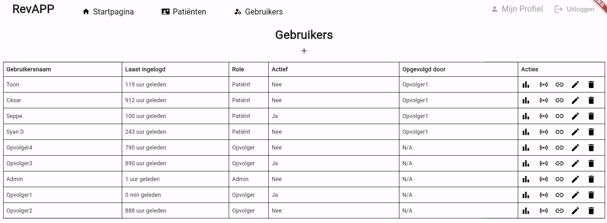
### Gebruiker toevoegen
Er is een mogelijkheid om een gebruiker toe te voegen tot het systeem. Hiervoor moet je klikken op het plus icoon bovenaan het scherm.
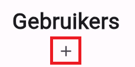
Vervolgens komt er een pop-up te voorschijn waar je de gegevens van de nieuwe gebruiker moet invullen.
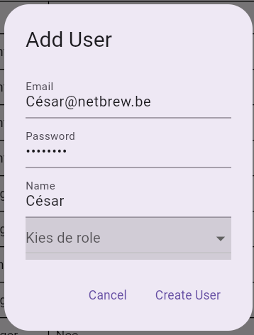
Wanneer een gebruiker de rol van patiënt krijgt, wordt er een extra invulveld toegevoegd waarin de opvolger van de patiënt kan worden aangeduid. Hierdoor wordt de behandelend arts niet alleen aan de patiënt toegewezen, maar verschijnt de patiënt ook in de lijst van de patiënten van de arts.
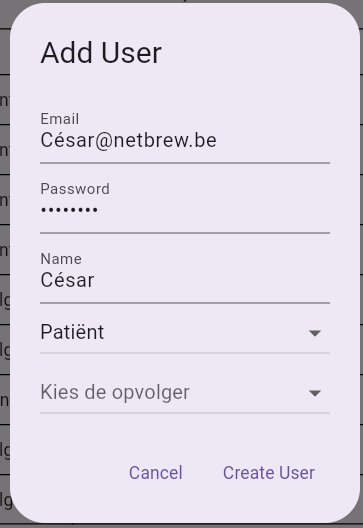
Als alle informatie is ingevuld, dan kan de gebruiker toegevoegd worden tot het systeem door te klikken op de knop 'Create User'. Vervolgens zal de nieuwe gebruiker in het systeem terecht komen.
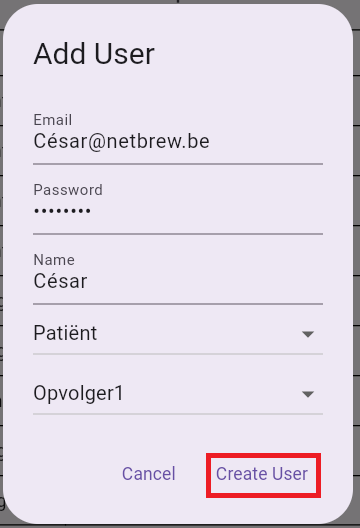
### Opvolger aanpassen van gebruiker
Het is mogelijk om een andere opvolger aan te wijzen voor een patiënt in het systeem. Als een patiënt wordt overgedragen van de ene behandelend arts naar de andere, kan dit worden gedaan via het link-icoon.
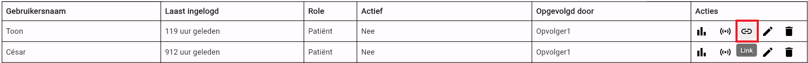
Hierdoor verschijnt er een pop-upvenster waarin de naam van de gebruiker en de huidige behandelend arts worden weergegeven. 
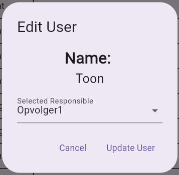
Vervolgens kan men in de lijst van behandelende artsen een nieuwe arts selecteren en deze wijziging opslaan door te klikken op de knop 'Update User'.
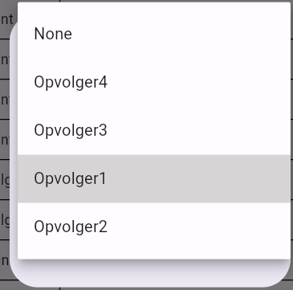
### Gebruikersnaam aanpassen
In het systeem kan de naam van een gebruiker ook worden aangepast. Dit kan door op het edit-icoon te klikken.
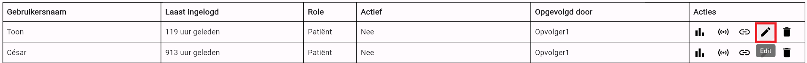
Hierdoor verschijnt er een pop-upvenster waarin de naam van de gebruiker ewordt weergegeven en deze aangepast kan worden. Om de aanpassing op te slagen moet men klikken op de knop 'Update Name'.
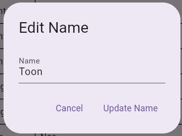
### Gebruiker verwijderen
Je kan ook een gebruiker verwijderen uit het systeem. Dit kan door op het delete-icoon te klikken.
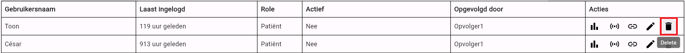
Hierdoor verschijnt er een pop-upvenster waar er expliciet wordt gevraagd of je zeker bent om deze gebruiker te verwijderen. Door op de 'Delete' knop te klikken, wordt de gebruiker verwijderd uit het systeem.
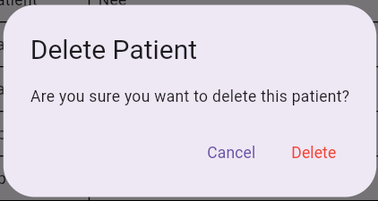
### Resultaten raadplegen van een gebruiker
Je kunt ook de resultaten van elke gebruiker raadplegen door op het "View Charts"-icoon te klikken.
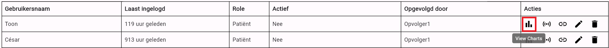
Vervolgens krijg je een overzicht van de resultaten van de patiënt zijn/haar oefeningen.
